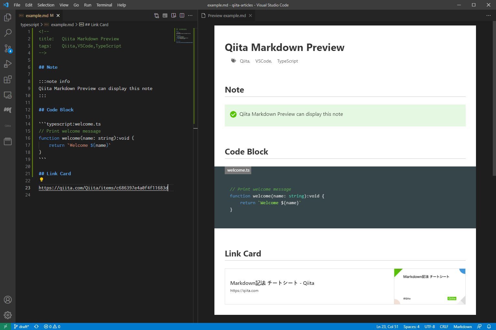
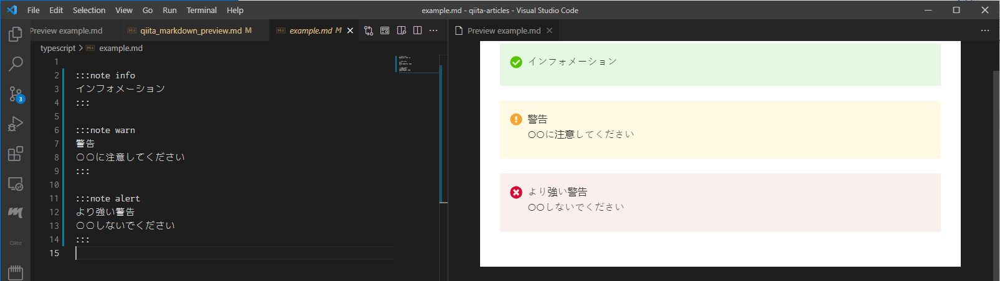

<!--
title:   【Qiita拡張記法プラグイン】Qiita記事をVSCodeで書くなら今すぐインストール！
tags:    Markdown,Qiita,TypeScript,VSCode,個人開発
id:      fe61d9234be2e147cb7f
private: false
-->


[](https://marketplace.visualstudio.com/items?itemName=ryokat3.vscode-qiita-markdown-preview)



Qiitaで拡張されたMarkdown記法をVSCodeで表示するVSCode extensionを開発しました。VSCodeのParserやRendererを拡張していますので、CSSによるスタイルの適用だけでは不可能な表現を可能にしています。

[Visual Studio Marketplace にて公開](https://marketplace.visualstudio.com/items?itemName=ryokat3.vscode-qiita-markdown-preview)されています。是非インストールしてお試しください。

# インストール

VSCodeの拡張機能で ”Qiita" で検索すれば "Qiita Markdown Preview" が検索結果に表示されますので "Install" をクリックしてください。下のアイコンです。


# 使用法

## 記事の作成

インストールが終われば、Qiita Markdown Preview はすでに有効になっています。VSCode 標準の Markdown Preview をお使いください。Qiita の独自拡張の Markdown 記法が表示されているはずです。

## 記事の投稿

是非 [Qiita-Sync](https://github.com/ryokat3/qiita-sync) で記事を投稿してみてください。VSCode で書いた記事を GitHub に push するだけで自動的に Qiita に投稿されます。画像ファイルもVSCode でまとめて編集、まとめて投稿できます。リンク先の URL を気にする必要もありません。

 [^1]


Qiita-Sync は GitHub の設定だけで導入できます。詳しくは下記の記事をご覧ください。

https://qiita.com/ryokat3/items/d054b95f68810f70b136


# 拡張記法表示例

Qiita Markdown Preview で対応している Qiita 拡張記法の表示例です。左側に Markdown、右側に preview が表示されていますので、

## Note - 補足説明

情報、注意、警告のレベルに応じた表示を行う拡張記法です。

### Qiita 表示

:::note info
実際のQiita表示です
:::

### Qiita Markdown Preview 表示



## コードの挿入

Syntax Highlight に加えて、ブロックの上に補足説明（ファイル名など）の情報を入れられる拡張記法です。

### Qiita 表示

```typescript:実際のQiita表示です
function hello(): {
   console.log('Qiita Markdown Preview')
}
```

### Qiita Markdown Preview 表示


## 数式の挿入

TeXで記述された数式を表示する拡張記法です。

### Qiita 表示

```math
\left( \sum_{k=1}^n a_k b_k \right)^{2} \leq
\left( \sum_{k=1}^n a_k^2 \right) \left( \sum_{k=1}^n b_k^2 \right)
```

### Qiita Markdown Preview 表示


## リンクカード

[Open Graph Protocol](https://ogp.me/)を利用した、リンク先のタイトルやサムネイルを表示するリンクを表示する記法です。

### Qiita 表示

https://qiita.com/Qiita/items/c686397e4a0f4f11683d

### Qiita Markdown Preview 表示


## タイトルとタグ

Qiita拡張記法ではなく、[Qiita-Sync](https://github.com/ryokat3)による拡張記法で、文書内でタイトルとタグを指定するときに使われている記法になります。

### Qiita Markdown Preview 表示


# 追記

今回初めて VSCode の拡張機能の実装を行いました。作成ツールが期待したように動作せず苦労の連続だったので、[その顛末を記したQiita記事](../typescript/vscode_publish_extension.md)も投稿いたしました。拡張機能作成に興味がある方は是非ご覧ください。

--------

[^1]: [図で使用した画像素材](https://www.pinterest.com/pin/create/button/?url=https%3A%2F%2Fpngtree.com%2Ffreepng%2Fman-working-on-computer-at-home-isometric-vector_4000330.html?share=3&media=https://png.pngtree.com/png-vector/20190219/ourlarge/pngtree-man-working-on-computer-at-home-isometric-vector-png-image_321818.jpg&description=Man+working+on+computer+at+home+isometric+vector) は [Man png from pngtree.com/](https://pngtree.com/so/Man) のものを使用しています。