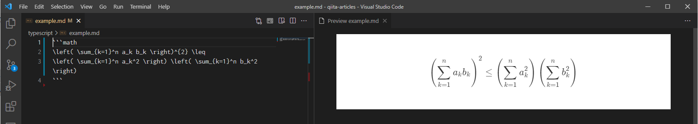

<!--
title:  Qiita記事をVSCodeで書くなら今すぐインストール！【Qiita拡張記法プラグイン】
tags:   Qiita,VSCode,個人開発,Markdown,TypeScript
-->

Qiitaで拡張されたMarkdown記法をVSCodeで表示するVSCode extensionを開発しました。VSCodeのParserやRendererを拡張していますので、CSSによるスタイルの適用だけでは不可能な表現を可能にしています。

Visual Studio Marketplace にて公開されています。是非インストールしてお試しください。

https://marketplace.visualstudio.com/items?itemName=ryokat3.vscode-qiita-markdown-preview

# 拡張記法表示例

## タイトルとタグ

## コードブロック

## 数式ブロック

## リンクカード

