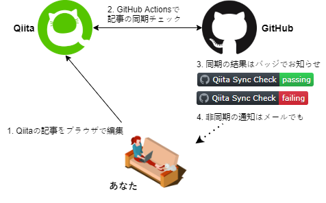
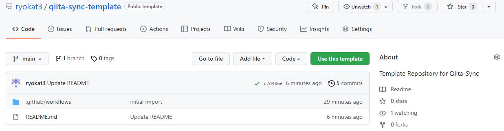
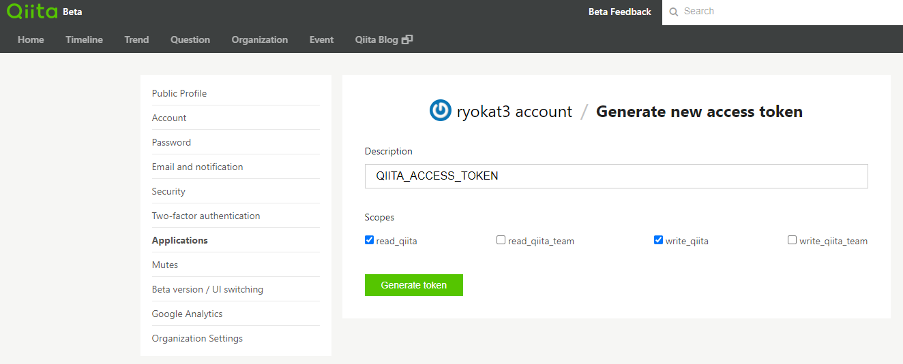
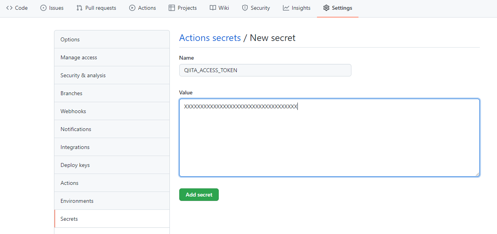
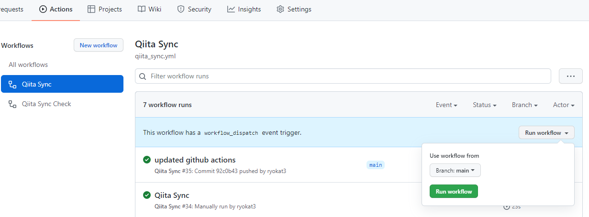
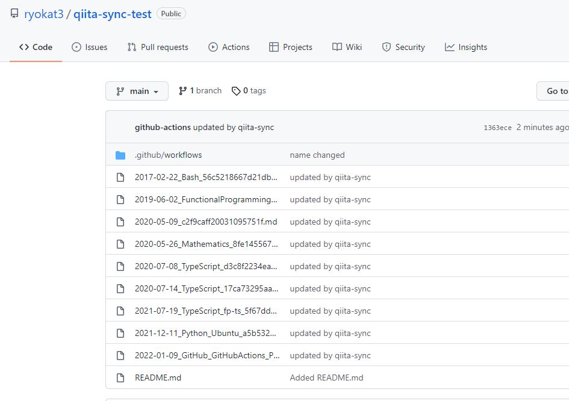

<!--
title:   GitHub連携でQiita記事を素敵な執筆環境で！
tags:    GitHub,GitHubActions,Python,Qiita,個人開発
id:      d054b95f68810f70b136
private: false
-->
# 「素敵な執筆環境」とは？

心地よいソファーだったり、甘えん坊だけどキーボードの上だけは避けてくれる猫のことではなく、vi とか emacs とか vscode とか、お気に入りのエディタを使った執筆環境を実現するために開発した [Qiita Sync](https://github.com/ryokat3/qiita-sync) の紹介です。

https://github.com/ryokat3/qiita-sync

## Qiita の記事を執筆する時の不満

個人的には以下のような Qiita 公式の Web アプリによる執筆時の不満を解消するため、この執筆環境を開発しました。

- Web アプリという性質上、マウスの使用を強要されたり、慣れたエディタのキーバインドが操作ミスになったり（Backspace 代わりの Ctrl-H で履歴画面を見せられる...）、個人的にイライラすることが多い。

- 図を更新の際に、Qiita のサイトに upload されたファイルを直接編集することはできず、図のファイルをローカルにコピーし、保存管理しておく必要がある。

- Markdown の Table は等幅フォントで編集したい。

## vi で記事を書いて GitHub に push するだけ

notepad でもいいですが、とにかくあとは Qiita Sync にお任せです。

1. Qiita の記事を vim で書いて、GitHub に push 
2. GitHub Actions が自動で Qiita に記事を upload （下図）

 [^1]

## 記事の同期も自動でチェック

Qiitaの記事をブラウザでチャチャっと作ったり、更新したり、そんな時は GitHub との同期が取れなくなることもあります。でも大丈夫、同期がとれないことは、GitHub の画面で確認できるし、GitHub からメールのお知らせが届きます。

記事の差分が確認できたら、クリックひとつで再び同期させることもできます。

1. Qiita の記事をブラウザで更新
2. GitHub Actions が定期的に記事の同期をチェック
3. 同期が取れていれば GitHub の GUI に緑のバッジ、そうでなければ赤のバッジを表示
4. 同期が取れていない時は GitHub からメールで通知

 [^1]

## インストールしなくていい、使い方も覚えなくていい

メインの機能を提供する Qiita Sync は python の CLI コマンドですが、GitHub Actions 上で動作するので、コマンドをインストールしたり、使い方や引数を覚えたりする必要はありません。もちろん python のインストールも不要です。

# 準備

## GitHub リポジトリの作成

[qiita-sync-template](https://github.com/ryokat3/qiita-sync-template) にアクセスして、"Use this template" をクリックします。リポジトリ名などは任意にお決めください。



## Qiita Access Token の生成

記事の投稿に [Qiita API v2](https://qiita.com/api/v2/docs) を使うので秘密鍵である Access Token が必要になります。Access Token は Qiita のユーザ画面から、

1. [Qiita Account Applications](https://qiita.com/settings/applications) を開く
2. "Generate new token" をクリック
3. "Desciption" は適当な説明を入力。
4. "Scopes" の "read_qiita" と "write_qiita" をチェック（下図）
5. "Generate token" をクリック
6. 生成された Access Token はコピーして保存しておく



## Qiita Access Token の登録

1. GitHub リポジトリの GUI から Settings >> Secrets で "Actions secrets" の画面を表示
2. 右上の "New repository secret" のボタンをクリック
3. Name には `QIITA_ACCESS_TOKEN` と入力
4. Value には Qiita で生成した Access Token を入力（下図）
5. "Add secret"をクリックして登録完了



## Qiita 記事の同期

手動でQiitaとGitHubを同期させます。

1. GitHub repository の GUI から "Actions" >> "Qiita Sync" を開く
2. "Run workflow" をクリックする（下図）

   

3. 数分後、Qiitaからダウンロードされた記事が GitHub リポジトリに追加されます。ファイル名は __最初に記事を作成した日付 + タグ + 記事の ID + .md__ になります。

   

## Qiita 記事のダウンロード

`git clone git@github.com:<Your-ID>/<Your-Repository>.git` で Qiita 記事をローカルのデバイスにダウンロードします。次の変更を加えます。

### ファイル名の変更

:::note info
ファイル名の変更や移動は自由
:::

分かりやすいファイル名に変更しましょう。拡張子が `.md` であればなんでも構いません。ディレクトリを作成して、カテゴリー分けするのも良いでしょう。ただし `README.md` というファイルはQiita との同期の対象から外されています。

### README.md の変更

ここまでくれば README に書かれている内容はもはや必要ありません。お好きなように書き換えてください。

強いお勧めとして、README に以下の画像リンクを追加すると、同期の成否を示すバッジが表示されるようになります。成功のバッジが表示されていると執筆の意欲も沸くのでおすすめです。

`<Your-ID>` と `<Your-Respository>` の部分はあなたのものに置き換えてください。

```markdown:バッジの画像リンク

```

以下のバッジが表示されます。

- 成功した場合:

  

- 失敗した場合:

  

### cron 時間の変更

Template には `.github/workflows/qiita_sync_check.yml` という YAML ファイルが含まれています。このファイルの `cron: "29 17 * * *"` の部分は変更をお願いします。利用者全員が同じ時間をになると、GitHub にも Qiita にも一斉に負担がかかるので、それを避けるためです。

:::note warn
cron の時間設定は変更する
:::

下記の例 `29 17 * * *` は 17:29 UTC なので日本時間だと毎日 02:29 JST に起動することになります。週一の起動でも構いません。

```yaml:.github/workflows/qiita_sync_check.yml
name: Qiita Sync Check

on:
  schedule:
    - cron: "29 17 * * *"
  workflow_run:
    workflows: ["Qiita Sync"]

# 以下省略
```

### 変更後のアップロード

変更が完了したら、再び git push で記事や設定をアップロードします。アップロード完了と同時に再び Qiita と同期が始まります。

これで準備は終了です。

# 同期

準備完了以降は、記事を書いて、git で push するだけです。あとは自動的に同期が始まるので、通常手動で同期を行うことはありません。

ただ、Qiita の Web アプリケーションで記事を更新すると、次の cron 起動じに上記の失敗した場合のバッジが表示されます。同時に GitHub に登録したメールアドレス宛にも通知が行きます。その他、複数の新しい記事を一度にダウンロードする場合などに失敗することがあります。

そのような場合には、以下の手順で GitHub Actions を実行し、記事を同期させるようにします。

1. GitHub repository を開く
2. "Actions"、"Qiita Sync" を開く
3. "Run workflow" をクリックする（下図）


# 記事の執筆

お気に入りのエディタで markdown を編集するのですが、記事の執筆時に幾つかの注意点があります。

## 記事のヘッダ

Qiita からダウンロードした記事には以下のようなヘッダがファイルの先頭に自動的に付加されます。

`title` や `tags` は自由に変更できますが、`id` を変更したり、消去したりすることはできません。一方 `id` は他の記事と共用はできないので、ファイルをコピーする時には `id` を消去してください。

:::note alert
ヘッダの id の取扱は注意する
:::

```markdown:通常のヘッダ
<!--
title: This header is automatically generated by Qiita-Sync when downloading Qiita articles
tags:  Qiita-Sync
id:    a5b5328c93bad615c5b2
-->
```

## 新しい記事の作成

新しい記事を作成する場合には、ヘッダに `id` は不要です。Qiita-Sync が、記事を Qiita にアップロードした後に `id` をファイルのヘッダに付加します。GitHub 上で Qiita-Sync がファイルの一部を書き換えることになるので、`git pull` などで local も最新に追従するようにしてください。

:::note warn
新しい記事を追加した後には同期後に git pull しておく
:::

```markdown:新規作成時のヘッダ
<!--
title: No id is necessary in the header when writing new articles
tags:  Qiita-Sync
-->
```

## 他の記事へのリンク

同じユーザの他の Qiita の記事へのリンクは、以下のようにファイルの相対パスで指定することができます。

```markdown:編集中のリンク
<!-- An example of link to another Qiita article when writing -->
[My Article](../my-article.md)
```

Qiita にアップロードされる際に自動的にURLに変換されます。

```markdown:アップロード時のリンク
<!-- An example of link to another Qiita article when published to Qiita site -->
[My Article](https://qiita.com/ryokat3/items/a5b5328c93bad615c5b2)
```

ダウンロード時には再び相対パスのリンクに変換されます。

## 画像ファイルへのリンク

画像ファイルへのリンクは、以下のように相対パスで指定することができます。

```markdown:編集中のリンク
<!-- An example of link to image file 'earth.png' when writing-->

```

Qiita にアップロードされる際に自動的にURLに変換されます。

```markdown:アップロード時のリンク
<!-- An example of link to image file 'earth.png' when published to Qiita site -->

```

ダウンロード時には再び相対パスのリンクに変換されます。

## Qiita Markdown Preview

もし記事をVSCode で書く場合には [Qiita Markdown Preview](./qiita_markdown_preview.md) のインストールをお勧めします。Qiita の Markdown 拡張記法が Preview で表示されます。詳しくは以下のリンクをご覧ください。

https://qiita.com/ryokat3/items/fe61d9234be2e147cb7f


[^1]: [図で使用した画像素材](https://www.pinterest.com/pin/create/button/?url=https%3A%2F%2Fpngtree.com%2Ffreepng%2Fman-working-on-computer-at-home-isometric-vector_4000330.html?share=3&media=https://png.pngtree.com/png-vector/20190219/ourlarge/pngtree-man-working-on-computer-at-home-isometric-vector-png-image_321818.jpg&description=Man+working+on+computer+at+home+isometric+vector) は [Man png from pngtree.com/](https://pngtree.com/so/Man) のものを使用しています。
