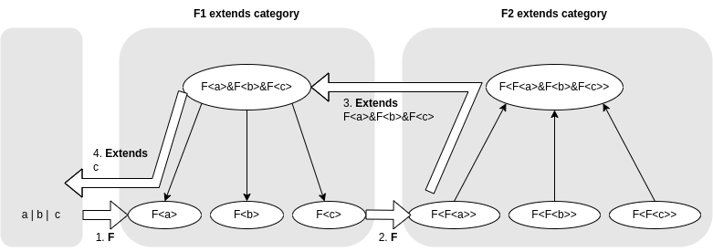

<!--
title:   TypesScript の Union 型から Tuple 型へ変換
tags:    FunctionalProgramming,TypeScript
private: false
-->

Stackoverflow で拾ったネタの紹介記事です。
TypeScript の型 `string | number | Date` から `[ "string", "number", "Date" ]` を導く方法です。

- [Define an array with infered types related to first prop in the array](https://stackoverflow.com/questions/66075326/define-an-array-with-infered-types-related-to-first-prop-in-the-array/)

この Stackoverflow の回答ではさらっと書かれているのですが、乏しくとも圏論の知識で整理しないと理解できなかったので、備忘録として記録しておきます。


## 関数型 `(x:X)=>void`

まず型プログラミングで取り扱いに困るのが交差型、型がつぶれる。

```ts
// T の型は never につぶれてしまう
type T = string & number
```

そこで型を関数型 `(x:X)=>void` に閉じ込めるとつぶれない。

```ts
// T の型は (x:string)=>void & (x:number)=>void のまま！
type T = (x:string)=>void & (x:number)=>void
```


## 関数型 `(x:X)=>void`　へまとめて変換

Distributive Condition Types を利用して `string | number | Date` を `(x:string)=>void | (x:number)=>void | (T:Date)=>void` へまとめて変換する。

```ts
// Distributive Conditional Types
type F<T> = T extends any ? (x:T)=>void : never
type T = F<string | number | Date>
// T: (x:string)=>void | (x:number)=>void | (T:Date)=>void
```

## extends 圏

材料が揃ってきたので、extends を使った圏（っぽいもの）が作れそう。

- 対象 : 関数型 (x:A)=>void
- 射 : (x:A)=>void --> (x:B)=>void if (x:A)=>void extends (x:B)=>void
- 積 : (x:A)=>void & (x:B)=>void
- 和 : (x:A)=>void | (x:B)=>void
- 関手 : (_)=>void

### 分配則

積 `&` と和 `|` は分配則を満たす。分配則を後でつかうわけではないけど、性質がよさそうなのが伺える。

```ts:分配則
// 'extends' category morphism :: A --> B if A extends B
//
type F<T> = T extends any ? (x:T)=>void : never

type a = string
type b = number
type c = Date

type Fa_X_FbIFc = F<a> & ( F<b> | F<c>)
type FaXFb_I_FaXFc = (F<a> & F<b>) | (F<a> & F<c>)

type Arrow<T, U> = [T]extends [U] ? [U] extends [T] ? "<-->" : "-->" : [U] extends [T] ? "<--" : never

// Distributive property holds if DP = "<-->"
type DP = Arrow<Fa_X_FbIFc, FaXFb_I_FaXFc>
```

[Playground Link](https://www.typescriptlang.org/play?ssl=15&ssc=43&pln=1&pc=1#code/PTAEHIFMA8BdIHYBMDO5QGMCG8DmB7AJwE9QBbIgBwAsBLFM0ALidAEFQBaTgPlACFQtAGbtQMeMhQCAUCBmxilSKABiAHgAqfALyhN4uIlSgsCUgH5QACmhNNASh08AbvlpJmoBJBeRCMgpKKligeiiwhLQIuEHKoABGYd4ArmQJ-nEqGMkAIjiQgYrxqlgA+gAaZaoJAJKqOXoaWHwAZDZq6gl8AD6dGDwOWWpYFTVltdWjDcnWzW2d3Q6gfXPqLaDtGgNDw2yEhPgA7loANKAAqrqgANqaALoSxtI3F-egVq-vT1K3Dx+gABE6m4PEBXkBoPBrC+hkkJju7yswO40O8vkycjAuXokVoCRSsFoflAlEOykIilA1HwABsTCJQLkAArJFG8QHDFnJfaHE6lSrVOoNc6lMYJCZTMYDIA)


### 一階関数型の圏

想定する一階関数型の圏（F1 extends category と呼ぶことにする）は下の図のような圏になる。

通常の型の圏（F0 extends category）にから反変関手 `F` によって F1 extends category に
移される。反変関手なので矢印の向きが逆になっている。

`F<a>&F<b>` と `F<a>|F<b>` は新たに和と積で計算されて追加された対象。

F1 をさらに `F` で移した F2 extends category も使用する。

```
A --> B if A extends B
F: Functor

# F0 extends category
a&b --> a --> a|b
    --> b

# F1 extends category
F<a|b> --> F<a>&F<b> --> F<a> --> F<a>|F<b> --> F<a&b>
                     --> F<b>

# F2 extends category
F<F<a&b>> --> F<F<a>|F<b>> --> F<F<a>>&F<F<b>> --> F<F<a>> --> F<F<a>>|F<F<b>> --> F<F<a>&F<b>> --> F<F<a|b>>
                                               --> F<F<b>>
```

F1 extends category を TypeScript で表現し、成立することを確認できる。

ただし F<> は関手ではない。なぜなら `a|b` を `F<a> | F<b>` に移してしまうから（関手なら `F<a|b>` に移すべき）。


```ts:F1 extends category
// 'extends' category morphism :: A --> B if A extends B
//
type F<T> = T extends any ? (x:T)=>void : never

type a = string
type b = number

// F1 extends Category
//
// F<a|b> --> F<a>&F<b> --> F<a> --> F<a>|F<b> --> F<a&b>
//                      --> F<b>
//

type F_aIb = (x:a|b)=>void
type FaXFb = F<a> & F<b>
type Fa = F<a>
type Fb = F<b>
type FaIFb = F<a> | F<b>
type F_aXb = (x:a&b)=>void

// All F1_X = "-->"
//
type Arrow<T, U> = [T]extends [U] ? [U] extends [T] ? "<-->" : "-->" : [U] extends [T] ? "<--" : never

type F1_1 =  Arrow<F_aIb, FaXFb>
type F1_2 =  Arrow<FaXFb, FaIFb>
type F1_2a = Arrow<FaXFb, Fa>
type F1_2b = Arrow<FaXFb, Fb>
type F1_3a = Arrow<Fa, FaIFb>
type F1_3b = Arrow<Fb, FaIFb>
type F1_4 =  Arrow<FaIFb, F_aXb>
```

[Playground Link](https://www.typescriptlang.org/play?#code/PTAEHIFMA8BdIHYBMDO5QGMCG8DmB7AJwE9QBbIgBwAsBLFM0ALidAEFQBaTgPlACFQtAGbtQMeMhQCAUCBmxilSKABiAHgAqfALyhN4uIlSgsCUgH5QACmhNNASh08AbvlpJmoBJBeRCMgpKKligeiiwhLQIuEHKoABGYd4ArmQJ-oEgagCMhpImAMI4kAQkcsAVaupYAD4JfNx8Glg8AGQaDVy81a3dzTU8tZ2NPS1tDVWg0zOzc-NN1ZPycSqqAPpYAJJJerZMdQlOru5Iq2pYABqqu718bUs856qhei1PivE3ySPP299vQagWqPZ6bS63fZYCbHNweLJgNgAGyRuXWl2SACImpiKuc2IRCPgAO5aAA0oAAqrpQABtTQAXQkxmktMpDNAVjZHOZUjpjM5oEx6hxXmxvExXm5+RZ-I5VmF3ElrB8fgCzxy6zyenYhJJ6g22wSFJe10mnzWmoATMldUTSaabib-ubgmira87frHcaLh83aprbcCfaDVcnWpXV9NQBmT0h71YZ1bG7+6PrGPBvUO30vFNRy3rAAstoTDpdJvBDSAA)

### 二階関数型の圏

二階関数型の圏（F2 extends category と呼ぶことにする）も示しておく。

```ts:F2 extends category
// 'extends' category morphism :: A --> B if A extends B
//
type F<T> = T extends any ? (x:T)=>void : never

type a = string
type b = number

// F2 Extends Category
//
// F<F<a&b>> --> F<F<a>|F<b>> --> F<F<a>>&F<F<b>> --> F<F<a>> --> F<F<a>>|F<F<b>> --> F<F<a>&F<b>> --> F<F<a|b>>
//                                                --> F<F<b>>
//
type F_F_aXb = F<(x:a&b)=>void>
type F_FaIFb = (x:F<a> | F<b>) => void
type FFaXFFb = F<F<a>> & F<F<b>>
type FFa = F<F<a>>
type FFb = F<F<b>>
type FFaIFFb = F<F<a>> | F<F<b>>
type F_FaXFb = F<F<a> & F<b>>
type F_F_aIb = (x:(x:a|b) => void) => void

// All F2_X = "-->"
type Arrow<T, U> = [T]extends [U] ? [U] extends [T] ? "<-->" : "-->" : [U] extends [T] ? "<--" : never

type F2_1 =  Arrow<F_F_aXb, F_FaIFb>
type F2_2 =  Arrow<F_FaIFb, FFaXFFb>
type F2_3a = Arrow<FFaXFFb, FFa>
type F2_3b = Arrow<FFaXFFb, FFa>
type F2_4a = Arrow<FFa, FFaIFFb>
type F2_4b = Arrow<FFb, FFaIFFb>
type F2_5 =  Arrow<FFaXFFb, FFaIFFb>
type F2_6 =  Arrow<FFaIFFb, F_FaXFb>
type F2_7 =  Arrow<F_FaXFb, F_F_aIb>
```

[Playground Link](https://www.typescriptlang.org/play?ssl=33&ssc=37&pln=1&pc=1#code/PTAEHIFMA8BdIHYBMDO5QGMCG8DmB7AJwE9QBbIgBwAsBLFM0ALidAEFQBaTgPlACFQtAGbtQMeMhQCAUCBmxilSKABiAHgAqfALyhN4uIlSgsCUgH5QACmhNNASh08AbvlpJmoBJBeRCMgpKKligeiiwhLQIuEHKoABGYd4ArmQJ-oEgagBMoACiRlKgAMI4kAQkcsDVauoaWABkCTx83HwaDTwAPhotbbx1XTyNner9XINjWK2THfXqMz1jE+1DiyN9s2vT3f21oIdHxyenZ+cXhzsL+-KK8aoA+k9YABpJehq2TE0JTq7uJA8OIqJ6qLAASVUHxsdi6oG6dRaDjCfDcHhBanBr1U0OS01mjXW+3uoPB+IWS0xuJhK1a1PBULxn0ps0RdOBpLUzzezPWM1ARK2nOC3JeEJh32+WD2KOcoHRSDlaMBWTAbAANhrco9XskAETtfWYtiEQj4ADuWgANKAAKq6UAAbU0AF0JMZpE67a7QFZvb6PcUXb6rPr1EavIbePqvAHDJITCG-aBw9xY6wfH4AtSco8AIzJdhmy31Z6PN4JW1gyHQkUPPN5PTF81WmtQqtY3l13OPADMoT0ptb9WxNOr4ProLzfZhw9LuO7ncXU51ABZBy2F+CJ7We1zVHm13OS23obumS1ewBWIvzs9Li801eHx4ANjvp9He+XPJxV4PPMAHZPxHGt-2rctIRaIA)


### Extends 型演算

Extends という型演算を定義する。型 T に対して、`T --> (x:X)=>void` という射があれば、`X` という型を取り出す。
関数の箱から取り出しているので、T が二階関数型の場合、X は一階関数型になる。

```ts
// Extranc X if morphism T --> (x:X)=>void holds
//
type Extends<T> = [T] extends [(x:infer X)=>void] ? X : never
```

## 準備完了、Union から型を１個とりだすぞ

やっと本番、`F` と `Extends` を使って、Union 型（ `string | number | Data` ）から型を１個とりだしてみる。

```ts
// 'extends' category :: A --> B if A extends B
//
type F<T> = T extends any ? (x:T)=>void : never
type Extends<T> = [T] extends [(x:infer X)=>void] ? X : never

type a = string
type b = number
type c = Date

// In F2 extends category, use this morphism
//
//   F<F<a>>|F<F<b>>|F<F<c>> --> F<F<a>&F<b>&F<c>>
//
type FaXFbXFc = Extends<F<F<a|b|c>>>

// In F1 extends category, use this morphism
//
//   F<a>&F<b>&F<c> --> F<a>
//                  --> F<b>
//                  --> F<c>
//
type oneOfabc = Extends<FaXFbXFc>
```

[Playground Link](https://www.typescriptlang.org/play?ssl=22&ssc=34&pln=1&pc=1#code/PTAEHIFMA8BdIHYBMDO5QGMCG8DmB7AJwE9QAuM0AQVAFpaA+UAIVAEsAza0GeZFFgCgQg2MQAOkUADEAPABUmAXlDyecRKlBYEpAPygAFNDLyAlEoYA3fGyTlQCSFciFREqQFEN-BctAA2vIAuup8WgHGZGwIHK6gABoW1rZIoQYJDk4ubu6S2qAqKLCEMbh5UgBGhY4ArgC2la4VmDUAIjiQgsJgAJIIMgBMYZoC2HhExAA0oLUoUrAAFmwC9UTiyyj1PT2ge3JyWAwMAD4HspXHZ7JyGMd0jDI3skcAZHKX77J3DDti+dIsAlpJVgRgat5wihnocTpUTj9frt+jIAIwjfiYToEEgzOYLTagNaEDYrbYiEB7J5vD4ML53B5MQ6-SlUtns9n0JkXFlgDn8tlcp53P4eUD4JwAeQ4WEq4JUkNGNyBILBDCAA)


図に描くとこんな感じ。




1. `a|b|c` を `F` で　`F<a>|F<b>|F<c>` に移す。

2. `F` さらにで `F<F<a>>|F<F<b>>|F<F<c>>` に移す。

3. F2 extends category の射 `F<F<a>>|F<F<b>>|F<F<c>> --> F<F<a>&F<b>&F<c>>` に基づいて、`Extends` で右辺の `F<>` の中身、`F<a>&F<b>&F<c>` を取り出す。

4. 取り出された型を F1 extends category の射 `F<a>&F<b>&F<c> --> F<c>` (右辺は `F<a>` か `F<b>` が適用されるかもしれない)）に適用すると、`c`（ `a` か `b` かもしれない）を得ることができる。

取り出し成功！　圏論的な部分はここまで。あとは、これを再帰的に適用して Tuple 型にしてやればよい、ここからは普通の TypeScript の技を駆使、[元記事](https://stackoverflow.com/questions/66075326/define-an-array-with-infered-types-related-to-first-prop-in-the-array/)に詳しい。


## 感想

いろんな技を習得できた。

- 型を関数型に閉じ込めて、性質をよくする
- extends 圏を定義して、どんな型が取り出し可能なのか明確になる
- モナモナしなくても圏論はアイデアの整理に使える