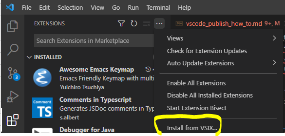
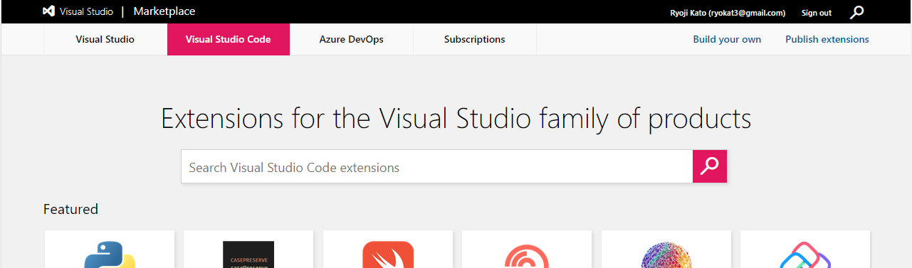
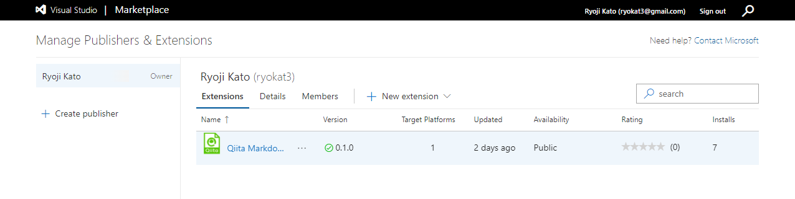

<!--
title:   はじめてのVSCode拡張開発 ～公式手順は茨の道なのか？～
tags:    Node.js,TypeScript,VSCode,個人開発,初心者
id:      35ed99ee2af2512b59bb
private: false
-->


[はじめてVScode拡張 plugin](https://marketplace.visualstudio.com/items?itemName=ryokat3.vscode-qiita-markdown-preview) を作成しました。公式の [公式のMarketplaceの公開手順](https://code.visualstudio.com/api/working-with-extensions/publishing-extension) を見る限りでは、[PyPI](https://pypi.org) や [npm](https://www.npmjs.com) でパッケージを公開するぐらいに簡単そうです。

ですがこの通りに行っても**とんでもなく上手くいきません**でした。顛末記として記事を共有することで、これから VSCode 拡張を開発する方の参考になれば幸いです。

この記事の手順で公開した VSCode 拡張プラグインが [Qiita Markdown Preview](https://marketplace.visualstudio.com/items?itemName=ryokat3.vscode-qiita-markdown-preview) になります。Webpack も含め全て Typescript を使用して開発しました。Typescript で作成された拡張プラグインはそれ程多くなかったので参考にしてみてください。

# 本記事で扱う内容

本記事では以下の各開発段階での注意点と簡単な手順を記しています。VSCode API 等のプログラミングについては触れていません。

:::note info
1. VSCode 拡張の開発
2. MarketPlace 向けパッケージの作成
3. MarketPlace でのパッケージの公開
:::

注意点の多くが [vsce](https://github.com/microsoft/vscode-vsce) (v2.6.7) という VSCode 拡張パッケージを作成したり、公開したりする Microsoft が開発しているツールが、私の環境ではまともに動かなかったことに起因します。vsce の他のバージョンや他の環境下では期待通りの動作になるかもしれません。

開発環境は以下のようになります。現時点 (2022年2月初旬) のほぼほぼ最新版です。

| 開発環境   | Version      |
|------------|--------------|
| OS         | Ubuntu 21.10 |
| Nodejs     | 16.13.2      |
| Typescript | 4.5.4        |
| Webpack    | 5.68.0       |
| **vsce**   | 2.6.7        |

# VSCode 拡張の開発

## 開発用 VSCode Workspace の作成

公式手順の [Your First Extension](https://code.visualstudio.com/api/get-started/your-first-extension)に従っていれば大丈夫です。あっという間にできあがります。分からない設定項目があっても後でいくらでも修正できます。

設定項目の中の "publisher" には Microsoft Marketplace に登録した ID を指定するので、先に ID を取得しておくとよいと思います。取得の手順はこの記事の最後でも紹介しています。

## 開発

いよいよ開発です。nodejs での開発に必要なツールの選択を行います。

### yarn

:::note warn
npm は使わず、yarn を使いましょう
:::

私も何度も試したのですが、**npm を使うとVSCode拡張パッケージがうまく作成できません**でした。

パッケージ作成に使う vsce の [issue](https://github.com/microsoft/vscode-vsce/issues) を色々みていると npm はどうた、yarn はこうだ、など色々書かれていおり、yarn を試したらたまたま上手く動きました。今のところ根本原因は分かっていません。

yarn は npm の代用品として使用できますが、コマンドが異なります。よく使うコマンドを紹介しておきます。

| 用途                              | npm                             | yarn                      |
|-----------------------------------|---------------------------------|---------------------------|
| 依存パッケージ一括インストール    | npm install                     | yarn                      |
| パッケージのインストール          | npm install \<name\>            | yarn add \<name\>         |
| 開発パッケージのインストール      | npm install \<name\> --save-dev | yarn add \<name\> -dev    |
| パッケージの更新                  | npm update \<name\>             | yarn upgrade \<name\>     |
| パッケージの削除                  | npm uninstall \<name\>          | yarn remove \<name\>      |


### webpack

:::note warn
できれば webpack を使いましょう
:::

webpack は必須ではないものの、言われるままにパッケージを作成してしまうと **node_modules 配下の全モジュールをパッケージに含める** ことになります。プラグイン実行時には必要のない開発用、テスト用 module も全部含まれてしまいます。

私の場合は全部入りはさすがにファイルサイズがでかく、どれが必要でどれが必要ないのか見定めるのも大変そうだったので webpack を使用しました。

ただ webpack がなくても VSCode 拡張として動作しますので、設定で苦労するようでしたら、使用しなくても問題ないと思います。

### プログラミング

拡張機能の種類による[プログラミングガイド](https://code.visualstudio.com/api/extension-guides/overview)が提供されています。簡潔にまとめられています。

また作りたい拡張機能と同じ種類の GitHub repository を探して真似ましょう。先人の知恵はありがたいことだらけです。

### デバッグ

`F5` を押せば、開発中のパッケージがインストールされたデバッグ用の VSCode が立ち上がって、リモートデバッグが可能になります。よく作られていて便利です。

# MarketPlace 向けパッケージの作成

機能が確認出来たらパッケージの作成です。いよいよ vsce の出番ですが、**vsce コマンドはインストールしません**。

## Docker版 vsce のインストール

:::note warn
vsce は docker 版を使用しましょう
:::

vsce は他のツールに依存するツールです。他の開発ツールも含めて、すべてに適したバージョンを探り当てるのは針の穴に駱駝を通すようなものと諦め、おとなしく docker に頼りましょう。

OS に docker をインストールし、GitHub の [vsce の README](https://github.com/microsoft/vscode-vsce#via-docker) に従って docker 版 vsce インストールします。

ただしこのまま docker を使用した場合は、出来上がったパッケージのファイルの owner が root になってしまいます。これが煩わしい場合には、Dockerfile に以下のコマンドを追加します。

```Dockerfile:Dockerfile
FROM node:14-alpine
# 追加部分開始 ===>
ARG USER
ARG GROUP
ARG UID
ARG GID
RUN adduser \
    --disabled-password \
    --gecos "" \
    --home "$(pwd)" \
    --ingroup "$GROUP" \
    --no-create-home \
    --uid "$UID" \
    "$USER"
# <=== 追加部分終了、以下省略
```

そして Docker image をビルドする際に Host OS の user/group を指定します。

```bash:Dockerイメージbuildコマンド
docker build -t vsce . \
--build-arg UID=$(id -u) \
--build-arg GID=$(id -g) \
--build-arg USER=$(id -un) \
--build-arg GROUP=$(id -gn)
```

## パッケージの作成

:::note warn
package.json の "vscode:prepublish" スクリプトを確認しましょう
:::

vsce はパッケージ作成前に `vscode:prepublish` に指定されているコマンドを実行し、終了するとパッケージを作成します。そのためこのコマンドが `tsc --wath` のようなファイルの watch モードに入るようなコマンドを含んでいると永遠にパッケージが作成されません。

Docker版 vsce でパッケージを作成する場合は以下のコマンドを使います。Docker image のビルドの中でご自身の user id を追加していない場合は `--user $(id -un)` の部分を除いてください。

```bash:VSCodeパッケージ作成コマンド
docker run --user $(id -un) -it -v $(pwd):/workspace vsce package
```

このコマンドで `.vsix` という拡張子のついたファイル (e.g. `vscode-qiita-markdown-preview-0.1.0.vsix`)が作成されます。

## パッケージの動作確認

`.vsix` ファイルは VSCode に直接インストールすることが出来るので動作確認をしておきます。

File >> Preferences >> extensions で左 pane の右上の "..." をクリックしたプルダウンメニューの一番下の項目を選択します。



# MarketPlace でのパッケージの公開

`vsce` を使ったパッケージ公開手順ではなく、GUI で公開する方法を紹介します。Personal Access Token を発行する必要はありません。


1. [Microsoft Marketplace](https://marketplace.visualstudio.com/) を open します

   

2. GUI 右上の "Publish Extension" をクリックし、拡張機能の管理画面を open します。アカウントをお持ちでない場合は適宜作成してください。

   

3. ”Publisher" を追加します（上図ではすでに追加されています）

4．"New Extension" をクリックして、`.vsix` のパッケージファイルを Drag and Drop で upload すれば、数分でパッケージが公開されます。
